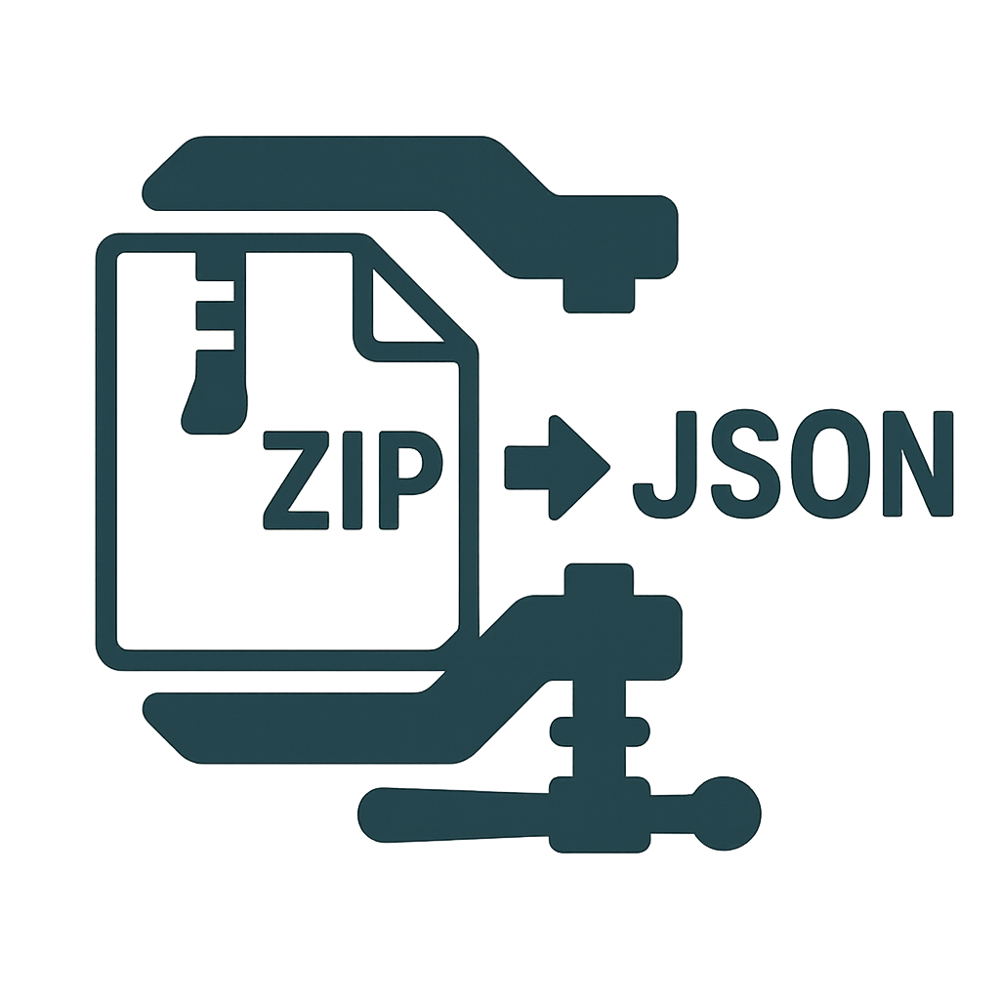

<div align="center">
  
</div>

# zip-json

[](https://github.com/hiddentao/zip-json/actions/workflows/ci.yml)
[](https://coveralls.io/github/hiddentao/zip-json?branch=main)
[](https://badge.fury.io/js/%40hiddentao%2Fzip-json)
[](https://opensource.org/licenses/MIT)
[](https://www.typescriptlang.org/)

A tool for compressing files and directories into JSON format that can be extracted and used at runtime.

## 🎯 **Perfect for Bun Native Binaries**

**zip-json** enables you to generate Bun native binaries with files and folders embedded within, which can then be extracted and used at runtime. This is especially powerful for:

- **📁 Bundling Drizzle ORM migration scripts** into a single executable
- **⚡ Embedding assets directly in native binaries** for zero-dependency distribution
- **🚀 Creating portable CLI tools** with all resources included
- **📦 Building self-contained applications** that don't require external files

Perfect for bundling assets, creating portable backups, or embedding resources directly in your applications.

## Features

- 🚀 **Fast & Lightweight** - Built for performance with Bun runtime optimization
- 📦 **JSON Format** - Archives stored as standard JSON with base64-encoded compressed data
- 🎯 **TypeScript Native** - Full type safety with comprehensive type definitions
- 🔧 **Dual Interface** - Both CLI and programmatic APIs
- 🎨 **Progress Tracking** - Real-time progress callbacks for large operations
- 🛡️ **Error Handling** - Comprehensive error types with detailed context
- 🌐 **Cross-Platform** - Works on Windows, macOS, and Linux
- 📁 **Glob Patterns** - Advanced file matching with ignore support
- ⚡ **High Compression** - Gzip level 9 compression for optimal file sizes

## Quick Start

### Installation

```bash
# Using Bun (recommended)
bun add @hiddentao/zip-json

# Using npm
npm install @hiddentao/zip-json

# Global CLI installation
bun add -g @hiddentao/zip-json
```

### Basic Usage

```typescript
import { zip, unzip, list } from '@hiddentao/zip-json'

// Create an archive
const archive = await zip(['src/**/*.ts', '*.md'], {
  baseDir: './project',
  ignore: ['node_modules/**', '*.test.ts']
})

// Extract files
const extractedFiles = await unzip(archive, {
  outputDir: './extracted'
})

// List contents without extracting
const files = list(archive)
console.log(`Archive contains ${files.length} files`)
```

### CLI Usage

```bash
# Create archive
zip-json zip "src/**/*.ts" "*.md" -o backup.json

# Extract archive
zip-json unzip backup.json -o ./restored

# List archive contents
zip-json list backup.json --detailed

# Silent operation for scripts
zip-json zip "src/**/*" -o backup.json --quiet
```

## Documentation

- 📖 [API Documentation](docs/api.md) - Complete API reference
- 🖥️ [CLI Documentation](docs/cli.md) - Command-line interface guide
- 📋 [Type Definitions](docs/types.md) - TypeScript type reference

## Examples


### Basic File Archiving

```typescript
import { zip, unzip } from '@hiddentao/zip-json'

// Archive TypeScript source files
const sourceArchive = await zip(['src/**/*.ts', 'types/**/*.d.ts'], {
  baseDir: './my-project',
  ignore: ['**/*.test.ts', 'node_modules/**']
})

// Save to file
await Bun.write('source-backup.json', JSON.stringify(sourceArchive, null, 2))

// Later, restore from file
const archive = await Bun.file('source-backup.json').json()
await unzip(archive, { 
  outputDir: './restored-project',
  preservePermissions: true 
})
```

### Progress Tracking

```typescript
import { zip } from '@hiddentao/zip-json'

const archive = await zip(['**/*'], {
  baseDir: './large-project',
  onProgress: (info) => {
    const percent = Math.round(info.percentage)
    const bar = '█'.repeat(percent / 5) + '░'.repeat(20 - percent / 5)
    console.log(`[${bar}] ${percent}% (${info.processedFiles}/${info.totalFiles})`)
    
    if (info.currentFile) {
      console.log(`Processing: ${info.currentFile}`)
    }
  }
})
```

### Error Handling

```typescript
import { zip, FileNotFoundError, PermissionError } from '@hiddentao/zip-json'

try {
  const archive = await zip(['src/**/*.ts'])
} catch (error) {
  if (error instanceof FileNotFoundError) {
    console.error(`File not found: ${error.filePath}`)
  } else if (error instanceof PermissionError) {
    console.error(`Permission denied: ${error.operation} ${error.filePath}`)
  } else {
    console.error('Unexpected error:', error.message)
  }
}
```

### Integration with Web APIs

```typescript
// Create archive and send via fetch
const archive = await zip(['dist/**/*'])
const response = await fetch('/api/deploy', {
  method: 'POST',
  headers: { 'Content-Type': 'application/json' },
  body: JSON.stringify(archive)
})

// Receive and extract archive
const receivedArchive = await response.json()
await unzip(receivedArchive, { outputDir: './deployed' })
```

### Selective File Operations

```typescript
import { list, unzip } from '@hiddentao/zip-json'

// Load archive and inspect contents
const archive = await Bun.file('backup.json').json()
const allFiles = list(archive)

// Filter for specific file types
const jsFiles = allFiles.filter(file => 
  file.path.endsWith('.js') && !file.isDirectory
)

console.log(`Found ${jsFiles.length} JavaScript files`)

// Create filtered archive (modify metadata)
const filteredArchive = {
  ...archive,
  meta: {
    ...archive.meta,
    files: jsFiles,
    fileCount: jsFiles.length
  }
}

// Extract only JavaScript files
await unzip(filteredArchive, { outputDir: './js-only' })
```

### Bun Native Binary with Embedded Files

Create a native binary with embedded Drizzle ORM scripts:

```typescript
// build-binary.ts
import { zip } from '@hiddentao/zip-json'
import { writeFileSync } from 'fs'

// 1. Bundle your migration files into JSON
const migrationArchive = await zip(['drizzle/**/*.sql', 'drizzle/meta/**/*'], {
  baseDir: './database',
  ignore: ['node_modules/**']
})

// 2. Create embedded archive module
const embeddedModule = `
// embedded-migrations.ts
export const MIGRATION_ARCHIVE = ${JSON.stringify(migrationArchive, null, 2)}
`
writeFileSync('src/embedded-migrations.ts', embeddedModule)

// 3. Build native binary with Bun
// bun build --compile --minify src/cli.ts --outfile my-app
```

```typescript
// cli.ts - Your application entry point
import { unzip } from '@hiddentao/zip-json'
import { MIGRATION_ARCHIVE } from './embedded-migrations.js'

async function runMigrations() {
  // Extract migrations at runtime
  const extractedFiles = await unzip(MIGRATION_ARCHIVE, {
    outputDir: './temp/migrations'
  })
  
  // Now run your Drizzle migrations
  console.log(`Extracted ${extractedFiles.length} migration files`)
  // ... run drizzle migrate logic
}

// Your native binary now contains all migration files!
await runMigrations()
```

**Result:** A single native executable containing all your database migration scripts, with zero external dependencies!

### Development Setup

Requirements

- **Node.js**: 22.0.0 or higher
- **Bun**: 1.0.0 or higher (recommended)
- **TypeScript**: 4.5.0 or higher (for TypeScript projects)

```bash
# Clone repository
git clone https://github.com/your-username/zip-json.git
cd zip-json

# Install dependencies
bun install

# Run tests
bun test

# Build project
bun run build

# Run CLI locally
bun run cli --help
```

### Testing

```bash
# Run all tests
bun test

# Run with coverage
bun test --coverage

# Run specific test file
bun test tests/unit/archiver.test.ts
```

## Contributing

We welcome contributions! Please see our [Contributing Guide](CONTRIBUTING.md) for details.

## License

MIT License - see [LICENSE.md](LICENSE.md) for details.

## Support

- 📧 **Issues**: [GitHub Issues](https://github.com/hiddentao/zip-json/issues)
- 📖 **Documentation**: [docs/](docs/)

